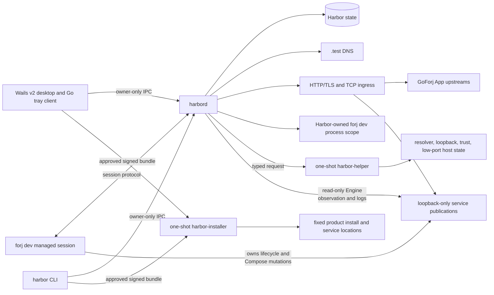
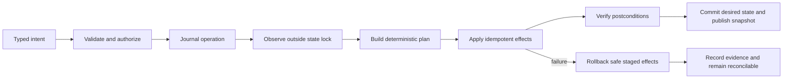

# Architecture

Status: approved target design; implementation tracked in [Current implementation state](./current-state.md)

## Shape

Harbor is daemon-first. The desktop is a control surface, not the process that keeps projects alive.



Four executable roles participate in normal operation. A fifth one-shot lifecycle role exists only for install, update, rollback, and uninstall:

| Role | Responsibility | Must not own |
|---|---|---|
| `harbord` | Desired state, reconciliation, DNS, ingress, managed-session process-scope ownership, read-only container observation, events, logs, and diagnostics. | Inner App/watcher lifecycle policy, Compose mutation, project semantics, arbitrary privileged operations. |
| `harbor` CLI | Human and automation client for the daemon. | Direct state, Docker/Compose, resolver, or project-file mutation. |
| Harbor desktop | Wails v2 window, Go tray integration, notifications, and settings client. | Durable runtime state or privileged host work. |
| `harbor-helper` | Apply one approved host mutation with only the OS authority that operation requires, then exit. | Network access, project execution, Docker access, arbitrary commands, or long-lived state. |
| `harbor-installer` | Independently verify and atomically apply one signed Harbor component bundle to fixed product locations, then exit. | Project execution, Docker access, arbitrary destinations, unsigned components, update download, or long-lived state. |

`forj dev` is not part of Harbor, but it is a first-class managed worker. GoForj compiles the project watcher graph, runs lifecycle and Compose tasks, builds Apps, performs graceful App/watcher supervision, and reports typed project intent, lifecycle, process, and resource facts. Harbor places every worker it starts inside one containing operating-system scope. GoForj gets the first opportunity to stop its inner graph; Harbor retains exact scope evidence as the final settlement boundary when that protocol is unavailable or the daemon restarts.

Container runtime facts have a different owner. The unprivileged daemon uses a narrow, read-only Docker Engine adapter to observe container state, publications, health, events, and logs. It attributes a container only when its Compose project, service, and working-directory labels agree with the registered canonical checkout. This observation cannot become an alternative Compose controller: Harbor never derives project intent from containers, parses Compose YAML, or calls create, start, stop, restart, remove, exec, build, pull, network-mutation, or volume-mutation APIs. Generated Apps, the helper, the desktop frontend, and CLI clients never receive Docker access.

## Authority

Harbor uses one writer per machine-local profile:

- `harbord` is the only process that writes Harbor state;
- clients submit typed intents and receive operation IDs, snapshots, and events;
- project processes report observations but cannot mutate another project;
- the helper applies a bounded effect selected and validated by the daemon;
- generated host files, listener state, and Docker ownership are projections, not competing sources of truth.

This avoids the failure mode where a CLI, desktop HTTP server, tray, and background watcher all edit the same YAML and then try to repair each other's changes.

## Source-of-truth split

| State | Owner | Examples |
|---|---|---|
| Project intent | `.goforj.yml` and GoForj | Apps, selected components, lifecycle tasks, Compose resources, watcher graph. |
| Project description | GoForj, versioned and value-free | Resolved Apps, non-secret service topology, endpoint capabilities, resource projection, compatibility. |
| Harbor desired state | Harbor database | Registered path, stable project ID, slug override, address leases, favorites, autostart preference, TLS preference. |
| Harbor observations | Harbor runtime/cache | PIDs, process birth evidence, container IDs, health, current private ports, log cursors. |
| Host integration | OS plus Harbor ownership records | Resolver route, CA fingerprint, loopback aliases, low-port rule. |
| Project secrets | Project environment/runtime | Database passwords, application keys, tokens. Harbor neither copies nor persists them. |

Harbor stores the last descriptor version, configuration digest, and non-secret projection for diagnostics. It re-reads the owner on start and configuration change rather than treating its cache as project intent.

No `harbor.yml` is added to a checkout in the first release. Machine-local preferences cannot become a second project lifecycle manifest.

## Repository shape

Harbor itself should be a GoForj multi-App project. This dogfoods the same App composition, Wire boundaries, generation, watcher graph, API documentation behavior, and cross-platform workflow that Harbor is designed to manage. The tree and development graph in this section describe the approved end state; [Current implementation state](./current-state.md) inventories the checked-in repository and actual `forj dev` graph.

Current GoForj requires a default App. Harbor uses that traditional boundary for the user-facing CLI and maps its build output to `harbor`; the daemon is a named App. The security-sensitive helper and installer are deliberately bespoke build nodes, not generated Apps:

```text
.goforj.yml             named-App development graph and project intent
go.mod                  shared headless module

cmd/app/                user-facing `harbor` CLI entrypoint
app/                    CLI composition and policy
app/wire/

cmd/harbord/            per-user daemon App entrypoint
app/harbord/            daemon composition and policy
app/harbord/wire/

cmd/helper/             bespoke one-shot `harbor-helper` entrypoint

cmd/installer/          bespoke one-shot `harbor-installer` entrypoint

desktop/                nested Wails v2 module and frontend
├── go.mod             isolates Wails and native desktop dependencies
├── main.go
├── wails.json
└── frontend/          pinned GoForj Vue starter import and Harbor UI

internal/
├── domain/             pure identities, states, transitions, and validation
├── rpc/                local protocol and clients
├── state/              schema, migrations, and transactions
├── reconcile/          desired/observed planner and effect scheduler
├── platform/           semantic OS interfaces and implementations
├── network/            addresses, DNS records, endpoints, and leases
├── ingress/            HTTP/TLS routing and native TCP relays
├── goforj/             project descriptor and managed-session adapter
├── supervise/          Harbor-owned outer forj dev lifecycle
├── trust/              CA and leaf lifecycle
└── doctor/             evidence and owned repairs
```

Named Apps share `internal/domain` and generated protocol packages, but they do not import another App's composition or Wire package. Current GoForj participation is explicit rather than inferred:

| Boundary | `dev.apps` / `dev.watches` behavior |
|---|---|
| default `app` → `harbor` | Build to `./bin/harbor`; `run: false`. |
| `harbord` | Build to `./bin/harbord`; explicit full-process `run.exec` starts the foreground daemon. |
| `harbor-helper` | Bespoke build-only custom watcher; not a generated App and never elevated by `forj dev`. |
| `harbor-installer` | Bespoke build-only custom watcher; not a generated App and never elevated by `forj dev`. |
| `desktop` | Nested module, not a `dev.apps` entry; a custom `dev.watches` entry runs Wails in `./desktop`. |

The target headless graph follows this GoForj shape:

```yaml
dev:
  apps:
    app:
      build:
        exec: forj build -o ./bin/harbor
      run: false
    harbord:
      build:
        exec: forj harbord build -o ./bin/harbord
      run:
        exec: ./bin/harbord --foreground
        watch: [.go]
  watches:
    - name: Build harbor-helper
      watch: [.go]
      roots: [./cmd/helper, ./internal]
      exec: go build -o ./bin/harbor-helper ./cmd/helper
    - name: Build harbor-installer
      watch: [.go]
      roots: [./cmd/installer, ./internal]
      exec: go build -o ./bin/harbor-installer ./cmd/installer
```

The desktop phase adds its custom development entry and verifies the final YAML through GoForj's parser and live watcher tests. One ordinary standalone `forj dev --no-harbor` then develops the complete graph. Developing Harbor must never launch the helper or installer elevated or leave either running as a watcher. The current checked-in `.goforj.yml` is intentionally smaller while installer and managed attachment work remain incomplete.

Interfaces are owned by the consumer package and describe semantic operations such as `EnsureResolverRoute` or `InstallTrustAnchor`. Platform implementations do not translate a Linux service file into another operating system's model.

The helper and installer deliberately do not use GoForj's generated App main, environment loader, preboot path, Wire composition, or generic RootCmd. Those surfaces load project configuration and inherit the project-wide component envelope, which is incompatible with a privileged boundary. They are bespoke minimal entrypoints represented as build-only custom dev nodes. Each has a separate dependency allowlist proving that networking clients, Docker, project execution, desktop, dotenv/compiled environment, and generic command dispatch cannot enter the binary.

The nested module is deliberate: Wails, WebView, CGO, frontend, and tray requirements must not raise the minimum Go version or native dependency floor of `harbor`, `harbord`, `harbor-helper`, or `harbor-installer`. The focused desktop proof instead decides the tray process boundary:

1. pin a stable Wails v2 release and a maintained cross-platform Go tray candidate;
2. prove their native event loops, close/hide behavior, single-instance focus, menus, and packaging together on macOS, Linux, and Windows;
3. prefer one desktop process when the integration is reliable;
4. if the native loops cannot coexist safely, move only the tray into a stateless `harbor-tray` daemon client;
5. keep daemon IPC as the authority boundary in either shape.

Harbor has a bootstrap rule: developing Harbor itself uses ordinary standalone `forj dev` before attachment exists and explicit `forj dev --no-harbor` once that capability ships, unless a separately installed Harbor is intentionally selected. Builds, tests, setup repair, and release must never require the checkout's in-progress daemon to already manage itself.

## Desktop boundary

A pinned stable Wails v2 release owns the native window, menus, WebView, single-instance behavior, and narrow Go bindings. Wails v2 does not own the tray. Harbor uses a separately selected Go tray implementation, preferring same-process integration after it passes the three-platform event-loop proof. A stateless `harbor-tray` client is the fallback, not a second runtime authority.

The embedded frontend is a plain Vue 3, TypeScript, Vite, and Tailwind CSS 4 SPA based on a pinned import of GoForj's source-owned shadcn-vue starter. Harbor preserves that primitive layer, uses Pinia for daemon snapshot/event presentation, and speaks through a typed bridge with a matching browser-test mock. Hash history keeps packaged navigation independent of a web-server fallback. [Frontend](./frontend.md) defines the source ownership and visual adaptation boundary.

The desktop Go backend is an ordinary daemon client. Frontend code never receives a raw daemon socket, bearer token, Docker socket, project command runner, or unrestricted filesystem API. The implemented Wails surface is `Status`, `Snapshot`, `AddProject`, `RemoveProject`, `SetupNetwork`, `StartProject`, `StopProject`, `RestartProject`, `ProjectActivity`, and `OpenResource`, with arguments validated again at the daemon boundary. `AddProject` opens the operating system's directory picker in the Go backend and submits only the selected path to the daemon; a new registration is stopped and has no routes or resources until later lifecycle work configures them. `RemoveProject` submits a client-owned idempotency intent, reconciles the returned operation against snapshots, and never deletes the checkout. Interactive approval for releasing initialized host networking remains outside the desktop surface.

`OpenResource` validates an `http` or `https` URL against the daemon's current resource snapshot and opens it in the system browser. Harbor never navigates its bridge-enabled WebView to a project App, API Index, Lighthouse, service dashboard, or any other project-controlled content. Unexpected main-frame navigation and raw-message origins are rejected.

Desktop single-instance behavior only focuses an existing window. It is not the daemon lock. By default, closing the last window hides it and leaves the desktop process alive for tray and best-effort notifications. `Quit Harbor UI` in the native application menu (`Cmd+Q` on macOS, `Ctrl+Q` elsewhere) explicitly exits only the client. Daemon shutdown is a separate control operation; the CLI implements it today, while a desktop stop action remains future work. On a Linux desktop without a usable tray, relaunch focuses the hidden single instance, the native Quit path remains available, and the CLI remains the runtime recovery path.

Bundled frontend assets are local. Harbor does not load remote application code into its bridge-enabled WebView.

## Daemon lifecycle

`harbord` is a per-user process because project checkouts, Go toolchains, Docker Desktop, environment, and logs are user-scoped.

| Platform | Lifecycle |
|---|---|
| macOS | Per-user LaunchAgent. Machine-global setup is applied separately by the helper. |
| Linux | `systemd --user` service when available; an explicit foreground/autostart fallback for supported non-systemd desktops. Linger is opt-in because it keeps projects alive after logout. |
| Windows | Per-user logon agent/task. A Session 0 Windows service is not the default because it cannot share the interactive user's environment or UI. |

The daemon uses a per-user lock and verifies the existing endpoint before replacing stale runtime state. It publishes readiness only after state migration and host-state observation complete.

`harbor daemon stop` requests graceful shutdown through the authenticated control connection. The daemon writes the acknowledgement before publishing its shared shutdown request, and the foreground runner joins runtime cleanup before exiting. Stopping the daemon makes Harbor endpoints unavailable; it is not a project lifecycle command.

The first release supports one active Harbor profile per machine. Ports 80/443, `.test` resolver ownership, and some loopback configuration are machine-global, so multiple simultaneously logged-in Harbor users would otherwise compete silently.

The helper atomically claims a protected machine-global ownership record before the first host mutation. The record binds the installation ID, owning UID/SID, selected address pool, resolver suffix, low-port mechanism, and schema version. Every privileged operation performs compare-and-swap against that record; another user cannot race setup between a preflight and apply. Repair and uninstall preserve a mismatched record and report manual evidence rather than taking it over. A future system broker may make multiple active profiles possible.

## Local IPC

Harbor control traffic does not use a TCP admin server.

- Linux and macOS use a Unix-domain socket in an owner-only runtime directory. The directory is mode `0700`, the socket is mode `0600`, and the daemon verifies the peer UID with the platform credential API.
- Windows uses a named pipe whose ACL grants only the current user SID and the required system identity.
- Each connection begins with `Hello` and `Welcome`, containing supported protocol ranges, role, daemon version, client version, and capabilities.
- Protocol compatibility is negotiated before any command. Major incompatibility fails immediately with upgrade guidance.
- Frames are length-prefixed JSON with a hard maximum, request IDs, cancellation, deadlines, and explicit error codes. Log payloads are chunked instead of bypassing the frame limit.
- Connections have bounded queues, concurrency, and idle timeouts. A client cannot create unbounded goroutines or hold a mutation forever.
- Mutations return an operation ID. Clients follow the operation event stream or fetch its final result.
- A snapshot plus monotonic sequence permits reconnect without deriving state from missed events.

The implemented V1 methods cover daemon status and shutdown, authoritative snapshots, natural-identity project registration, intent-keyed project unregistration, network setup, project start, stop, and scoped restart, and bounded output from only the current durable project session. The desktop drives the network-setup helper handoff without exposing tickets to TypeScript. Interactive project-removal approval and some equivalent CLI coverage remain incomplete.

The envelope is stable and golden-tested. Additive fields are tolerated inside a protocol major; semantic removals require a new major. Generated fixtures keep the daemon, CLI, desktop backend, and GoForj session adapter aligned.

Local socket permissions keep other users out, but any process running as the same user is still potentially hostile. The API therefore exposes only bounded domain operations, never arbitrary shell, filesystem, proxy, Docker, or SQL execution.

## GoForj session channel

The daemon-to-GoForj channel uses the same transport properties but a separate role and capability set. A session is bound to one canonical project root, descriptor digest, session nonce, and process identity.

Two ownership modes exist:

- `harbor`: the daemon starts `forj dev --managed`, supervises the outer process, and may restore it according to user policy;
- `terminal`: a foreground `forj dev` registers itself, retains terminal ownership, and reconnects if the daemon restarts.

For a Harbor-owned session, the daemon issues a short-lived one-use credential through an inherited descriptor or owner-only runtime file, not a command-line argument visible in process listings. A terminal-owned session discovers the per-user endpoint, authenticates through Unix peer credentials or the Windows pipe ACL/SID, and presents its canonical root, descriptor digest, nonce, and capabilities before lifecycle work. The daemon returns a credential bound to that root, peer, and session only after confirming registration and exclusive ownership. Session credentials cannot call machine-level setup or control another project.

GoForj publishes typed snapshots and ordered events. Harbor does not parse the TUI, ANSI output, command help, or Lighthouse's presentation stream.

## State

Harbor uses SQLite with WAL mode for durable machine-local state. The daemon owns the only connection pool that writes. Logical tables cover:

- schema migrations;
- registered projects and slug history;
- address and public endpoint leases;
- project preferences;
- sessions and process ownership evidence;
- certificate metadata and fingerprints, but not private keys;
- operations and reconciliation journals;
- bounded diagnostic history;
- update and installation state.

CA and leaf private keys live in a dedicated owner-only data directory, created with restrictive permissions on the first open. Writes use a temporary file in the same directory, file sync, atomic rename, and parent-directory sync. Certificate and key pairs are validated together before publication.

Logs and reconstructable observations use cache/runtime storage rather than the durable desired-state tables. The design must use platform-standard config, data, cache, and runtime directories instead of assuming one Unix home layout.

Schemas are versioned and migrations are transactional. Unknown persisted fields are not silently ignored. Before an update migrates state, the updater creates a verified rollback point compatible with the previous daemon.

## Reconciliation

Harbor treats every mutation as desired state plus observed state, not a list of UI side effects.



The planner is pure: the same desired and observed inputs produce the same ordered actions and diagnostics. Effects are narrow interfaces implemented per platform.

The scheduler owns all dirty signals—filesystem change, process exit, GoForj service observation, network change, resume from sleep, certificate expiry, and periodic audit—and coalesces them into one reconciliation loop. Feature-specific watchers do not mutate shared state independently.

Operations are idempotent and ownership-marked. A crash after an effect but before commit leaves a journal entry and observable marker that the next daemon can finish or remove. Rollback never deletes a persistent volume, project file, certificate it does not own, or foreign listener.

## Project lifecycle

The daemon coordinates, but GoForj executes, a project lifecycle:

```text
registered/stopped
    → reconcile identity, DNS, certificate, and private listeners
    → start managed forj dev session
    → GoForj resolves active Apps and builds them
    → GoForj runs phased pre-Compose tasks, then typed Compose with private publication assignments
    → GoForj reports publication intent; Harbor corroborates actual publications and activates native routes
    → GoForj runs post-Compose readiness, database setup/migrations, post-migrate tasks, and its watcher graph
    → Harbor verifies upstreams and publishes ready endpoints
    → typed rebuild/restart actions stay inside the session
    → graceful stop lets GoForj apply phased down behavior through the same typed Compose identity/override
    → endpoints become stopped; durable identity and volumes remain
```

GoForj supplies the adopted Compose project identity and may inject Harbor session labels through an untracked runtime override when needed. Harbor independently observes Compose's built-in labels and canonical working-directory evidence. Registration preserves the checkout's existing Compose identity when containers or volumes already exist; it cannot switch an existing project to a Harbor-derived name and make its data appear empty. New projects may use a stable Harbor-derived identity. Any later identity migration is explicit, data-aware, and outside ordinary start.

Harbor does not attribute a container based only on a name prefix. Container IDs, Compose labels, and canonical checkout ownership are observations; GoForj's resource plan remains the source of service intent and GoForj performs every Compose mutation.

External resources are displayed and diagnosed but never started, stopped, proxied, or migrated unless their descriptor explicitly marks a Harbor-manageable local endpoint.

## Service ownership

Harbor shares the control plane and isolates the project data plane.

Shared machine-level components are:

- `harbord`, DNS, CA/trust integration, HTTP/TLS ingress, and native TCP relays;
- the desktop and CLI clients;
- Docker's normal image-layer cache;
- host diagnostics and update machinery.

Project-owned components remain separate Compose projects and volumes:

- MySQL, MariaDB, or PostgreSQL;
- Redis and other caches/queues;
- Mailpit;
- VictoriaMetrics, Grafana, and their project provisioning;
- any future data-bearing service selected by the GoForj project plan.

This follows current GoForj ownership and preserves independent versions, configuration, credentials, data, start/stop behavior, and failure boundaries. Stable loopback identities remove the usual host-port reason to collapse these services into one global instance.

A shared MySQL or Redis instance would require Harbor to own database/key namespaces, credentials, incompatible version policy, cross-project restarts, data retention, and migration behavior. That is a second service platform and is outside V1.

GoForj may describe an existing shared or remote service as external. Harbor can present and diagnose that resource, but it does not convert external ownership into Harbor ownership. A future opt-in shared-service pool requires a separate design and cannot become the default through automatic deduplication.

## Process supervision

Harbor supervises only process scopes it starts. Each durable receipt contains:

- project and session IDs;
- an unpredictable nonce;
- the platform scope identity and launch PID;
- exact process start time or platform birth identity;
- executable path and expected arguments;
- owner mode;
- graceful stop deadline and escalation result.

Unix launches use one dedicated session as the containing scope. Watchers may create their own process groups, but they remain inside that session. Recovery enumerates the complete session and revalidates every member's birth and session immediately before signaling. Windows uses a Job Object while its handle remains authoritative and exact native creation evidence for restart observation; cross-generation scope settlement must be proved by the Windows platform contract before support is claimed.

GoForj remains responsible for the graceful inner App and watcher lifecycle. Harbor requests a typed action first. If the session is unavailable, Harbor may settle only the exact containing scope proven by its receipt. PID reuse, a mismatched executable or birth, an unreadable scope member, or incomplete scope settlement makes that project route-free and unavailable while retaining its evidence. It does not authorize a best-effort PID kill, clear the session, or prevent unrelated projects and the daemon from operating.

## Events and logs

State events and logs are separate concepts.

State events have a protocol version, project/session/App/watcher/service identity, monotonic sequence, timestamp, kind, previous and next state where relevant, process data, and structured error fields.

Logs preserve:

- source identity;
- honest stream identity: stdout, stderr, or PTY/combined;
- text captured before GoForj's TUI or Lighthouse presentation decoration;
- producer timestamp and daemon receive sequence;
- explicit dropped-count events;
- bounded retention and backpressure.

Process logs enter through the managed GoForj session. Harbor-managed children may use separate pipes, while a terminal-owned PTY remains explicitly combined. Container stdout/stderr enters through the daemon's read-only Docker adapter and remains tied to the exact observed container and logical Compose service. The UI can merge streams chronologically but cannot erase their provenance.

Access to a rootful Docker socket can make daemon compromise effectively root; calling the adapter read-only describes the methods Harbor permits, not a capability boundary imposed by Docker. The adapter is therefore daemon-local, deliberately small, endpoint-allowlisted in tests, and unavailable to generated Apps, frontend bindings, the helper, or arbitrary extensions. Installations that cannot give the per-user daemon access to the selected local Engine report container observation as unavailable rather than elevating `harbord`.

Harbor support bundles are generated locally, show a preview, redact known secret shapes and project environment values, and require explicit user action before leaving the machine.

## Privilege boundary

The desktop process and `harbord` never run elevated. This does not mean Harbor avoids elevated installation work: `harbor-helper` is elevated through the operating system's normal consent flow only when a host mutation requires it.

The initial Windows full-mode profile uses an interactive local-administrator account running Harbor under its normal filtered, medium-integrity token. UAC elevates the same account to its linked high token, so the user SID and `CurrentUser\Root` profile remain the same. A true non-admin account that must supply a different administrator's credentials is preview-only until Harbor can prove split-identity admission and keep user-scoped trust mutation in the original user's unelevated context; the helper must never write the consenting administrator's profile by accident.

Depending on the platform, elevation is expected for:

- creating or persisting project loopback identities such as `127.0.0.11`, `127.0.0.12`, and `127.0.0.13`;
- installing the `.test` resolver route or exact hosts-file entries;
- installing a trust anchor in a protected certificate store;
- arranging access or forwarding for ports 53, 80, and 443;
- installing or removing an owned login/service definition needed to restore that host state.

Some Linux kernels may accept binds throughout `127.0.0.0/8` without adding each address, and user-scoped certificate stores may need less authority. Harbor still discovers and tests the actual platform behavior instead of assuming elevation is unnecessary.

### Elevation flow

The daemon remains the operation authority even though a desktop or terminal may need to present the operating system's consent UI:

1. a client requests setup, registration, repair, or uninstall;
2. the daemon validates the desired change and creates a short-lived helper ticket bound to the installation ID, exact operation, expected preconditions, nonce, and expiry;
3. the desktop or CLI launches the platform-admitted helper directly for user-scoped work or through the normal root/Administrator consent mechanism for machine mutations, passing only the opaque ticket reference;
4. the helper authenticates the ticket and daemon endpoint, re-observes every privileged precondition, and rejects any mismatch;
5. it applies one allowlisted effect, returns typed evidence, and exits;
6. the unprivileged daemon independently observes the postcondition before committing the operation.

The ticket schema is versioned and size-bounded, bound to the requesting UID/SID and machine ownership generation, and single-use with replay protection. Destinations are compiled platform constants rather than request-selected paths. Before accepting the ticket, the helper verifies platform admission evidence: Apple code signatures, Windows Authenticode identity, or Ubuntu package signature/metadata plus root-owned installed digests.

The client never constructs a privileged command or supplies an arbitrary path. Cancelling the consent prompt leaves the operation in visible `requires_approval` state and safely retryable. Background reconciliation never opens a surprise consent prompt; an interactive desktop or CLI action must initiate it. The Phase 0 platform work must choose the supported consent API on macOS, Linux, and Windows; an embedded password prompt or shell command is not acceptable.

`harbor-helper` accepts exactly one typed operation per invocation:

- install, repair, or remove Harbor's resolver integration;
- ensure or release an owned loopback identity;
- install or remove a CA certificate by exact fingerprint;
- install, repair, or remove the platform's low-port forwarding/service definition;
- remove the enumerated host artifacts proven to belong to this Harbor installation and ownership generation.

The helper:

- has no network client or server;
- never invokes a shell;
- clears its environment and uses absolute tool paths where an OS API is unavailable;
- accepts no arbitrary destination path or command;
- validates canonical paths, file ownership, modes, fingerprints, and current contents again after elevation;
- uses opened descriptors or directory-relative APIs where possible to prevent path replacement between validation and use;
- writes atomically and backs up only files it can prove it owns or safely extends;
- emits a typed result and exits.

Harbor does not install a passwordless grant for a generic command such as `resolvectl`, `ifconfig`, PowerShell, or a package manager.

The preferred first-run setup performs durable host integration so project start/stop is unprivileged. It may pre-provision a bounded, conflict-checked loopback pool when that is the safest supported platform mechanism. If a platform instead requires elevation for each new identity, registration presents that elevation explicitly. The platform proof phase must choose between those mechanisms with real OS evidence; it cannot make the desktop or daemon permanently elevated merely to avoid a consent prompt.

## Network and proxy security

- Public development listeners bind only Harbor-owned loopback addresses by default.
- Container publications bind `127.0.0.1`, never an omitted address, `0.0.0.0`, or `::`.
- The HTTP proxy rejects unknown Host and SNI values and has no catch-all forwarder.
- Router updates are candidate-built, collision-checked, and atomically published.
- Header size, body size, TLS handshake, upstream connect, read, write, idle, and WebSocket lifecycle limits are explicit.
- Native TCP relays accept only a fixed local listener and fixed observed upstream chosen by the reconciler.
- GoForj exclusively owns Compose intent and mutations. `harbord` uses Docker only for attributed read-only observation, events, and logs; no Docker operation reaches a client, generated App, helper, or frontend binding.
- Project roots are canonicalized and constrained. Registering a project does not grant arbitrary path browsing to the frontend.

LAN exposure, remote control, and public tunnels are outside the first-release security model.

## Certificates

Harbor owns one local CA per user profile and issues leaf certificates for registered exact domains. CA generation and leaf issuance occur in the unprivileged daemon; the helper installs only the public root and verifies its expected fingerprint.

The trust subsystem:

- uses modern CA and leaf constraints, server-auth usage, and key/certificate matching;
- protects private keys from first creation rather than correcting permissions afterward;
- reloads and validates persisted material at startup;
- rotates leaves before expiry and publishes a cert/key pair only after both validate;
- records the exact store/scope, fingerprint, pre-existing state, installing Harbor identity, and ownership generation;
- adopts but never removes an identical trust anchor that existed before this installation;
- removes an anchor only when this installation added it and the current store entry still matches;
- rotates a CA through a dual-trust transition: install the new root, issue and activate new leaves, verify clients, drain old leaves, then remove the old root only when Harbor owns it;
- reports browser-specific Linux trust gaps instead of claiming universal trust.

The intended default scopes are the interactive user's login keychain on macOS, `CurrentUser\Root` on Windows, and the supported distribution's system trust mechanism on Linux where a user-scoped equivalent does not serve the tested browser/client matrix. A Linux machine-store CA is bound to the single active Harbor profile and machine ownership record. Each supported platform profile documents and tests its actual scope.

## Updates and installation

A Harbor release is one versioned component bundle containing a compatible desktop, daemon, CLI, helper, installer, service definitions, protocol range, and state schema. The manifest binds the release channel, monotonically increasing release sequence, every component name/version/digest, supported platform, and bundle digest. The installer rejects an older committed sequence, a replayed manifest, a channel mismatch, or any mix of components from different bundles unless a separate signed rollback authorization applies.

Release artifacts are built once, assigned immutable digests, and promoted through channels without rebuilding. An offline or isolated signing job receives only those digests and provenance through short-lived workload identity; ordinary CI and self-hosted product-test workers never hold long-lived release keys. The trust format supports signing-key rotation, revocation, threshold/emergency policy, and an overlap window rooted in the installed trust anchor. Each executable, service asset, and manifest is independently authenticated, and the signed bundle prevents individually valid components from being mixed into an untested combination.

The unprivileged daemon downloads into an owner-only staging directory, but it cannot apply an update. An interactive CLI or desktop action launches the signed `harbor-installer`, elevated through normal OS consent only when the fixed install or service locations require it. The installer has no network client. It accepts one bounded bundle manifest and staging root, independently verifies platform admission evidence, every component digest/signature, channel, sequence, installation identity, fixed destination, and current installed bundle, then exits after the transaction.

Update flow is:

1. download and preliminarily verify without stopping the active version;
2. validate protocol and schema migration compatibility;
3. stage the complete bundle in a new versioned install directory;
4. have the current trusted installer create a protected, single-use rollback capsule bound to the operation ID, current committed sequence/bundle digest, candidate sequence/digest, expiry, and a pre-migration state/schema snapshot;
5. stop accepting mutations, drain clients, and stop the old UI/daemon so Windows file locks cannot block replacement;
6. let the currently installed trusted installer reverify the capsule and candidate—including the candidate installer—then atomically switch the fixed launcher/service definitions, migrate state, and start the candidate daemon while the old installer continues from its unchanged versioned directory;
7. run local DNS, TLS, IPC, state, helper, and component-version smoke checks;
8. on success, atomically advance the sequence high-water mark and invalidate the capsule; on failure before commit, use that capsule once to restore the exact prior bundle and schema snapshot.

The rollback capsule is not a general downgrade token. It authorizes only the previous committed bundle during its still-uncommitted update operation and cannot be reused after success, expiry, another update, or a high-water-mark change. A later user-requested downgrade requires a separately signed rollback manifest.

Versioned directories and a fixed launcher/pointer avoid overwriting the running installer. Platform adapters use an atomic symlink/current-directory switch where supported, a Windows launcher/junction or installer transaction, and native package-manager transactions where mandated. Destinations are compiled product locations; neither the manifest nor a caller can select an arbitrary path.

Package-manager installs are updated through that manager when required, while preserving the same signed-bundle and sequence checks where the package format permits. Wails' single-application updater is insufficient for this multi-process transaction.

Native release jobs perform macOS hardened-runtime signing and notarization, Windows Authenticode and installer tests, and Linux package tests against the supported desktop/runtime matrix.

## Failure and recovery

| Failure | Behavior |
|---|---|
| Desktop exits | Daemon, projects, DNS, and ingress continue; relaunch reconnects from a snapshot. |
| Daemon restarts | Harbor observes each exact durable process receipt. A matching managed session may reconnect; otherwise Harbor settles the complete owned scope before retiring evidence. Uncertainty quarantines only that project as unavailable and route-free while preserving the receipt for repair. |
| Docker stops | Apps or resources depending on it become degraded/failed with one Docker diagnostic; no repeated destructive retries. |
| Network/VPN changes | One dirty signal triggers resolver and route observation, then an owned repair if needed. |
| Sleep/resume | Revalidate loopback aliases, low-port ingress, DNS, certificates, PIDs, and Docker publications. |
| Project path moves | Mark unavailable and offer an explicit relink to a matching descriptor; never scan and assume. |
| Port is occupied | Identify the listener when permitted, keep the endpoint failed, and do not shift the public port. A busy port alone never authorizes a signal; automatic cleanup requires either an exact Harbor receipt or an exact project primary lease plus same-user checkout-owned listener scope, while other unattributed-process actions require explicit user inspection and confirmation. |
| Config changes | Ask GoForj for a new descriptor, diff desired endpoints, and apply a transactional session refresh. |
| Partial registration | Resume or roll back ownership-marked staged effects from the operation journal. |
| Unsupported protocol | Refuse the operation with required version ranges; do not parse human output as fallback. |

Every recovery path must be represented in the cross-platform test matrix, with real host integration where the operating system behavior is material.

### Stale runtime repair

Recovery distinguishes three cases:

1. A current exact receipt authorizes automatic settlement of only its complete revalidated Harbor-owned scope.
2. A retained legacy session that lacks the new complete-scope receipt remains quarantined. It may offer `Inspect stale runtime`, but confirmation is allowed only through a short-lived daemon-owned plan bound to the caller, project, session, lease, target, and exact native candidate evidence.
3. A listener whose Harbor session was already retired is explicitly unattributed. When the primary lease is exact, Start may automatically settle one uniquely correlated same-user `forj dev` scope or listener process whose working directory is the registered checkout. Without that lease/correlation, `Inspect listener` remains the explicit path; it must not call the process Harbor-owned or mutate a nonexistent Harbor session.

Clients never supply a PID, address, or scope to stop. Inspection returns bounded display facts and an opaque plan identity. Confirmation re-reads every durable fence and native birth, executable, arguments, working directory, parent/scope, and socket fact immediately before signaling. Expiry, replacement, respawn, ambiguity, cross-user ownership, unreadable evidence, or any drift sends zero signals and requires a fresh inspection.

For a retained legacy session, Harbor retires the durable session and returns the route-free project to stopped only after exact process-birth absence and socket release are proved in one state transition. For an already-retired listener, automatic Start settlement changes no Harbor ownership state and retries only after proving the exact scope and socket are gone; an explicit user-authorized stop follows the same no-session rule. A lone child listener without a stable root remains diagnostic-only.
