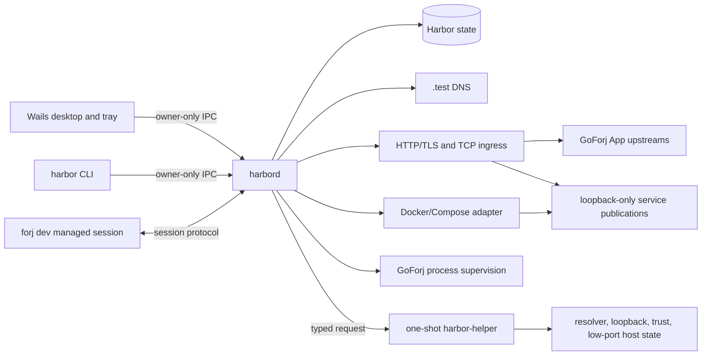
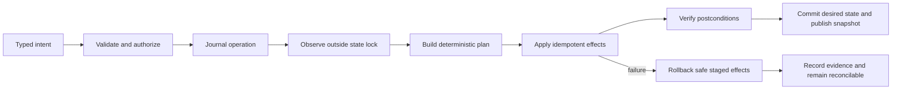

# Architecture

Status: proposed

## Shape

Harbor is daemon-first. The desktop is a control surface, not the process that keeps projects alive.



There are four executable roles:

| Role | Responsibility | Must not own |
|---|---|---|
| `harbord` | Desired state, reconciliation, DNS, ingress, project sessions, Docker coordination, events, logs, and diagnostics. | Desktop lifecycle, project semantics, arbitrary privileged operations. |
| `harbor` CLI | Human and automation client for the daemon. | Direct state, Docker, resolver, or project-file mutation. |
| Harbor desktop | Wails window, tray, notifications, and settings client. | Durable runtime state or privileged host work. |
| `harbor-helper` | One approved privileged host mutation, then exit. | Network access, project execution, Docker access, arbitrary commands, or long-lived state. |

`forj dev` is not part of Harbor, but it is a first-class managed worker. GoForj still compiles the project watcher graph, runs lifecycle tasks, builds Apps, and supervises project processes.

## Authority

Harbor uses one writer per machine-local profile:

- `harbord` is the only process that writes Harbor state;
- clients submit typed intents and receive operation IDs, snapshots, and events;
- project processes report observations but cannot mutate another project;
- the helper applies a bounded effect selected and validated by the daemon;
- generated host files, listener state, and Docker ownership are projections, not competing sources of truth.

This avoids the failure mode where a CLI, desktop HTTP server, tray, and background watcher all edit the same YAML and then try to repair each other's changes.

## Source-of-truth split

| State | Owner | Examples |
|---|---|---|
| Project intent | `.goforj.yml` and GoForj | Apps, selected components, lifecycle tasks, Compose resources, watcher graph. |
| Project description | GoForj, versioned and secret-free | Resolved Apps, service intent, endpoint capabilities, resource projection, compatibility. |
| Harbor desired state | Harbor database | Registered path, stable project ID, slug override, address leases, favorites, autostart preference, TLS preference. |
| Harbor observations | Harbor runtime/cache | PIDs, process birth evidence, container IDs, health, current private ports, log cursors. |
| Host integration | OS plus Harbor ownership records | Resolver route, CA fingerprint, loopback aliases, low-port rule. |
| Project secrets | Project environment/runtime | Database passwords, application keys, tokens. Harbor neither copies nor persists them. |

Harbor stores the last descriptor version, configuration digest, and non-secret projection for diagnostics. It re-reads the owner on start and configuration change rather than treating its cache as project intent.

No `harbor.yml` is added to a checkout in the first release. Machine-local preferences cannot become a second project lifecycle manifest.

## Repository shape

The implementation should keep the headless core independent of desktop dependencies:

```text
cmd/
├── harbor/             CLI client
├── harbord/            per-user daemon
└── harbor-helper/      one-shot privileged helper
internal/
├── domain/             pure identities, states, transitions, and validation
├── rpc/                local protocol and clients
├── state/              schema, migrations, and transactions
├── reconcile/          desired/observed planner and effect scheduler
├── platform/           semantic OS interfaces and implementations
├── network/            addresses, DNS records, endpoints, and leases
├── ingress/            HTTP/TLS routing and native TCP relays
├── goforj/             project descriptor and managed-session adapter
├── compose/            constrained Compose operations and observations
├── supervise/          Harbor-owned process lifecycle
├── trust/              CA and leaf lifecycle
└── doctor/             evidence and owned repairs
desktop/                separate Wails module and embedded frontend
```

Interfaces are owned by the consumer package and describe semantic operations such as `EnsureResolverRoute` or `InstallTrustAnchor`. Platform implementations do not translate a Linux service file into another operating system's model.

The desktop should be a nested Go module if Wails requires a newer Go release than the daemon and CLI. A desktop toolchain choice must not raise the minimum Go version of GoForj or the headless Harbor client without a concrete dependency constraint.

## Desktop boundary

Wails v3 provides the window, menus, tray, native notifications, and bindings. As of 2026-07-18 it is still alpha, so Harbor must pin an exact release or commit and keep the dependency behind the desktop module.

The desktop Go backend is an ordinary daemon client. Frontend code never receives a raw daemon socket, bearer token, Docker socket, project command runner, or unrestricted filesystem API. Wails services expose narrow operations such as `ListProjects`, `StartProject`, and `OpenResource` and validate every argument again at the daemon boundary.

Wails single-instance behavior only focuses an existing window. It is not the daemon lock. Closing the last window follows a Harbor preference, but neither path stops `harbord` or projects. `Quit Harbor UI` and `Stop Harbor daemon` are intentionally different operations.

Bundled frontend assets are local. Harbor does not load remote application code into its privileged WebView.

## Daemon lifecycle

`harbord` is a per-user process because project checkouts, Go toolchains, Docker Desktop, environment, and logs are user-scoped.

| Platform | Lifecycle |
|---|---|
| macOS | Per-user LaunchAgent. Machine-global setup is applied separately by the helper. |
| Linux | `systemd --user` service when available; an explicit foreground/autostart fallback for supported non-systemd desktops. Linger is opt-in because it keeps projects alive after logout. |
| Windows | Per-user logon agent/task. A Session 0 Windows service is not the default because it cannot share the interactive user's environment or UI. |

The daemon uses a per-user lock and verifies the existing endpoint before replacing stale runtime state. It publishes readiness only after state migration and host-state observation complete.

The first release supports one active Harbor profile per machine. Ports 80/443, `.test` resolver ownership, and some loopback configuration are machine-global, so multiple simultaneously logged-in Harbor users would otherwise compete silently. Setup and doctor detect another owner and fail with evidence. A future system broker may make multi-user support possible.

## Local IPC

Harbor control traffic does not use a TCP admin server.

- Linux and macOS use a Unix-domain socket in an owner-only runtime directory. The directory is mode `0700`, the socket is mode `0600`, and the daemon verifies the peer UID with the platform credential API.
- Windows uses a named pipe whose ACL grants only the current user SID and the required system identity.
- Each connection begins with `Hello` and `Welcome`, containing supported protocol ranges, role, daemon version, client version, and capabilities.
- Protocol compatibility is negotiated before any command. Major incompatibility fails immediately with upgrade guidance.
- Frames are length-prefixed JSON with a hard maximum, request IDs, cancellation, deadlines, and explicit error codes. Log payloads are chunked instead of bypassing the frame limit.
- Connections have bounded queues, concurrency, and idle timeouts. A client cannot create unbounded goroutines or hold a mutation forever.
- Mutations return an operation ID. Clients follow the operation event stream or fetch its final result.
- A snapshot plus monotonic sequence permits reconnect without deriving state from missed events.

The envelope is stable and golden-tested. Additive fields are tolerated inside a protocol major; semantic removals require a new major. Generated fixtures keep the daemon, CLI, desktop backend, and GoForj session adapter aligned.

Local socket permissions keep other users out, but any process running as the same user is still potentially hostile. The API therefore exposes only bounded domain operations, never arbitrary shell, filesystem, proxy, Docker, or SQL execution.

## GoForj session channel

The daemon-to-GoForj channel uses the same transport properties but a separate role and capability set. A session is bound to one canonical project root, descriptor digest, session nonce, and process identity.

Two ownership modes exist:

- `harbor`: the daemon starts `forj dev --managed`, supervises the outer process, and may restore it according to user policy;
- `terminal`: a foreground `forj dev` registers itself, retains terminal ownership, and reconnects if the daemon restarts.

The daemon issues a short-lived session credential through an inherited file descriptor or an owner-only runtime file, not a command-line argument visible in process listings. Session credentials cannot call machine-level setup or control another project.

GoForj publishes typed snapshots and ordered events. Harbor does not parse the TUI, ANSI output, command help, or Lighthouse's presentation stream.

## State

Harbor uses SQLite with WAL mode for durable machine-local state. The daemon owns the only connection pool that writes. Logical tables cover:

- schema migrations;
- registered projects and slug history;
- address and public endpoint leases;
- project preferences;
- sessions and process ownership evidence;
- certificate metadata and fingerprints, but not private keys;
- operations and reconciliation journals;
- bounded diagnostic history;
- update and installation state.

CA and leaf private keys live in a dedicated owner-only data directory, created with restrictive permissions on the first open. Writes use a temporary file in the same directory, file sync, atomic rename, and parent-directory sync. Certificate and key pairs are validated together before publication.

Logs and reconstructable observations use cache/runtime storage rather than the durable desired-state tables. The design must use platform-standard config, data, cache, and runtime directories instead of assuming one Unix home layout.

Schemas are versioned and migrations are transactional. Unknown persisted fields are not silently ignored. Before an update migrates state, the updater creates a verified rollback point compatible with the previous daemon.

## Reconciliation

Harbor treats every mutation as desired state plus observed state, not a list of UI side effects.



The planner is pure: the same desired and observed inputs produce the same ordered actions and diagnostics. Effects are narrow interfaces implemented per platform.

The scheduler owns all dirty signals—filesystem change, process exit, Docker event, network change, resume from sleep, certificate expiry, and periodic audit—and coalesces them into one reconciliation loop. Feature-specific watchers do not mutate shared state independently.

Operations are idempotent and ownership-marked. A crash after an effect but before commit leaves a journal entry and observable marker that the next daemon can finish or remove. Rollback never deletes a persistent volume, project file, certificate it does not own, or foreign listener.

## Project lifecycle

The daemon coordinates, but GoForj executes, a project lifecycle:

```text
registered/stopped
    → reconcile identity, DNS, certificate, and private listeners
    → start managed forj dev session
    → GoForj runs pre-tasks and Compose with the Harbor runtime overlay
    → GoForj builds Apps and starts its watcher graph
    → Harbor verifies upstreams and publishes ready endpoints
    → typed rebuild/restart actions stay inside the session
    → graceful stop lets GoForj apply configured down behavior
    → endpoints become stopped; durable identity and volumes remain
```

Harbor observes containers by a deterministic Compose project name and Harbor/GoForj labels. It does not operate on a container based only on a name prefix. Container IDs and labels are recovery evidence; GoForj's resource plan remains the source of service intent.

External resources are displayed and diagnosed but never started, stopped, proxied, or migrated unless their descriptor explicitly marks a Harbor-manageable local endpoint.

## Process supervision

Harbor supervises only processes it starts. Each record contains:

- project and session IDs;
- an unpredictable nonce;
- PID;
- process start time or platform birth identity;
- executable path and expected arguments;
- owner mode;
- graceful stop deadline and escalation result.

Recovery verifies all available evidence before signaling a PID. PID reuse or a mismatched executable becomes a stale observation, never permission to kill.

GoForj remains responsible for child App and watcher process groups. Harbor requests a typed action from the session rather than reaching into those process trees.

## Events and logs

State events and logs are separate concepts.

State events have a protocol version, project/session/App/watcher/service identity, monotonic sequence, timestamp, kind, previous and next state where relevant, process data, and structured error fields.

Logs preserve:

- source identity;
- stdout or stderr;
- raw text without terminal decoration;
- producer timestamp and daemon receive sequence;
- explicit dropped-count events;
- bounded retention and backpressure.

Container logs enter through the constrained Compose adapter. GoForj process logs enter through the managed session. The UI can merge them chronologically but cannot erase their provenance.

Harbor support bundles are generated locally, show a preview, redact known secret shapes and project environment values, and require explicit user action before leaving the machine.

## Privilege boundary

The Wails process and `harbord` never run as root or Administrator.

`harbor-helper` accepts exactly one typed operation per invocation:

- install, repair, or remove Harbor's resolver integration;
- ensure or release an owned loopback identity;
- install or remove a CA certificate by exact fingerprint;
- install, repair, or remove the platform's low-port forwarding/service definition;
- remove all host state proven to belong to this Harbor installation.

The helper:

- has no network client or server;
- never invokes a shell;
- clears its environment and uses absolute tool paths where an OS API is unavailable;
- accepts no arbitrary destination path or command;
- validates canonical paths, file ownership, modes, fingerprints, and current contents again after elevation;
- uses opened descriptors or directory-relative APIs where possible to prevent path replacement between validation and use;
- writes atomically and backs up only files it can prove it owns or safely extends;
- emits a typed result and exits.

Harbor does not install a passwordless grant for a generic command such as `resolvectl`, `ifconfig`, PowerShell, or a package manager.

The preferred first-run setup performs durable host integration so project start/stop is unprivileged. If a platform requires elevation for each new loopback identity, registration presents that elevation explicitly. The platform proof phase must determine whether a bounded preallocated pool or an owned boot-time rule can avoid repeated prompts without widening helper authority.

## Network and proxy security

- Public development listeners bind only Harbor-owned loopback addresses by default.
- Container publications bind `127.0.0.1`, never an omitted address, `0.0.0.0`, or `::`.
- The HTTP proxy rejects unknown Host and SNI values and has no catch-all forwarder.
- Router updates are candidate-built, collision-checked, and atomically published.
- Header size, body size, TLS handshake, upstream connect, read, write, idle, and WebSocket lifecycle limits are explicit.
- Native TCP relays accept only a fixed local listener and fixed observed upstream chosen by the reconciler.
- The Docker socket is available only to the daemon's constrained adapter. It is never exposed through Wails or a generic RPC.
- Project roots are canonicalized and constrained. Registering a project does not grant arbitrary path browsing to the frontend.

LAN exposure, remote control, and public tunnels are outside the first-release security model.

## Certificates

Harbor owns one local CA per user profile and issues leaf certificates for registered exact domains. CA generation and leaf issuance occur in the unprivileged daemon; the helper installs only the public root and verifies its expected fingerprint.

The trust subsystem:

- uses modern CA and leaf constraints, server-auth usage, and key/certificate matching;
- protects private keys from first creation rather than correcting permissions afterward;
- reloads and validates persisted material at startup;
- rotates leaves before expiry and publishes a cert/key pair only after both validate;
- tracks user-store versus machine-store installation separately;
- removes only the exact recorded fingerprint;
- reports browser-specific Linux trust gaps instead of claiming universal trust.

## Updates and installation

A Harbor release contains a compatible desktop, daemon, CLI, helper, service definitions, protocol range, and state schema. Each executable artifact and update manifest is signed under an embedded trust anchor and verified before staging. Checksums covered by a signature are verified again after download.

Update flow is:

1. download and verify without stopping the active version;
2. validate protocol and schema migration compatibility;
3. stage all components and a rollback artifact;
4. stop accepting mutations and drain the desktop connection;
5. replace components and service definitions as one operation;
6. migrate state and start the daemon;
7. run local DNS, TLS, IPC, and state smoke checks;
8. commit the update or restore the verified previous release.

Package-manager installs are updated through that manager when required. Wails' single-application updater is insufficient for this multi-process transaction.

Native release jobs perform macOS hardened-runtime signing and notarization, Windows Authenticode and installer tests, and Linux package tests against the supported desktop/runtime matrix.

## Failure and recovery

| Failure | Behavior |
|---|---|
| Desktop exits | Daemon, projects, DNS, and ingress continue; relaunch reconnects from a snapshot. |
| Daemon restarts | Project processes may continue; GoForj sessions reconnect; the daemon reconciles listeners, Docker observations, and state before accepting mutations. |
| Docker stops | Apps or resources depending on it become degraded/failed with one Docker diagnostic; no repeated destructive retries. |
| Network/VPN changes | One dirty signal triggers resolver and route observation, then an owned repair if needed. |
| Sleep/resume | Revalidate loopback aliases, low-port ingress, DNS, certificates, PIDs, and Docker publications. |
| Project path moves | Mark unavailable and offer an explicit relink to a matching descriptor; never scan and assume. |
| Port is occupied | Identify the listener when permitted, keep the endpoint failed, and do not shift the public port or kill the owner. |
| Config changes | Ask GoForj for a new descriptor, diff desired endpoints, and apply a transactional session refresh. |
| Partial registration | Resume or roll back ownership-marked staged effects from the operation journal. |
| Unsupported protocol | Refuse the operation with required version ranges; do not parse human output as fallback. |

Every recovery path must be represented in the cross-platform test matrix, with real host integration where the operating system behavior is material.
