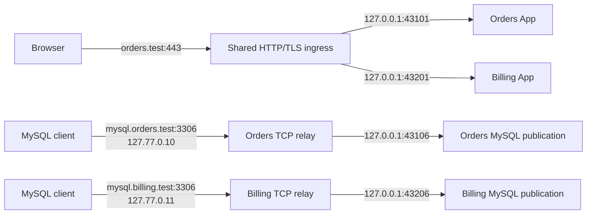

# Networking

Status: proposed, with platform proof gates called out below

## Contract

Harbor's network promise is user-facing on the published OS/browser/client support matrix:

- application URLs have stable `.test` names and no arbitrary port suffix;
- HTTPS is locally trusted by every browser and native client listed for that platform profile;
- raw infrastructure keeps its protocol-native port;
- several projects can expose the same native ports concurrently;
- no project `.env`, Compose file, or documented port needs a machine-specific edit;
- every listener is loopback-only unless a future, separately designed sharing feature is enabled.

Private upstream ports are implementation details. Harbor can publish two containerized MySQL instances on different private high ports while both remain available to the user at `:3306` through different project addresses.

## Why domains are not enough

HTTP carries a Host header and TLS carries SNI, so one address and port can route many web domains. Raw MySQL, PostgreSQL, and Redis clients do not provide the requested DNS hostname to a generic TCP proxy in a portable way.

Socket identity is protocol, local address, and local port. These two endpoints can coexist:

```text
127.77.0.10:3306
127.77.0.11:3306
```

These cannot:

```text
127.0.0.1:3306  → orders MySQL
127.0.0.1:3306  → billing MySQL
```

Changing only the DNS names still produces the same second socket after resolution. A transparent protocol-aware proxy would need reliable routing data inside every supported wire protocol, which is not available and would make Harbor responsible for database protocol compatibility.

Harbor therefore uses:

- one shared address for all Host/SNI-routable HTTP and HTTPS domains;
- one stable loopback identity per project for native TCP endpoints;
- an additional project-owned identity only when two resources inside the same project require the same protocol and public port.

This is the concrete reason Harbor accepts the cross-platform loopback work that a web-only tool can avoid.

## Topology

Example with two projects:

| Public endpoint | DNS answer | Harbor listener | Private upstream |
|---|---:|---:|---:|
| `https://orders.test` | `127.0.0.1` | `127.0.0.1:443` | `127.0.0.1:43101` |
| `https://admin.orders.test` (named App) | `127.0.0.1` | `127.0.0.1:443` | `127.0.0.1:43102` |
| `https://mail.orders.test` | `127.0.0.1` | `127.0.0.1:443` | `127.0.0.1:43103` |
| `mysql.orders.test:3306` | `127.77.0.10` | `127.77.0.10:3306` | `127.0.0.1:43106` |
| `redis.orders.test:6379` | `127.77.0.10` | `127.77.0.10:6379` | `127.0.0.1:43107` |
| `https://billing.test` | `127.0.0.1` | `127.0.0.1:443` | `127.0.0.1:43201` |
| `mysql.billing.test:3306` | `127.77.0.11` | `127.77.0.11:3306` | `127.0.0.1:43206` |
| `redis.billing.test:6379` | `127.77.0.11` | `127.77.0.11:6379` | `127.0.0.1:43207` |

The addresses and high ports in this table are illustrative, not reserved constants.



The HTTP router and native TCP relays are one Harbor ingress subsystem inside `harbord`. “One ingress” means one authoritative routing service, not one physical socket for protocols that cannot share a socket.

## Names

Default conventions are:

| Resource | Domain |
|---|---|
| Default App | `<project>.test` |
| Named App | `<app>.<project>.test` |
| API | The owning App domain and routes supplied by GoForj |
| Lighthouse | `https://<app-domain>/lighthouse` unless GoForj resolves another URL |
| API Reference / Swagger | `https://<app-domain>/swagger` unless GoForj resolves another URL; the GoForj API Index remains its backing artifact |
| Mailpit web UI | `mail.<project>.test` |
| Mail SMTP | `smtp.<project>.test:1025` |
| MySQL | `mysql.<project>.test:3306` |
| PostgreSQL | `postgres.<project>.test:5432` |
| Redis | `redis.<project>.test:6379` |
| Grafana | `grafana.<project>.test` |
| VictoriaMetrics | `metrics.<project>.test` |

GoForj's resolved resource projection supplies the actual resource IDs and protocols. Harbor applies naming policy and detects collisions; it does not infer enabled tools from these examples.

The project slug is chosen at registration, normalized with DNS-label rules, and stable across directory renames. A named App or resource that collides with another proposed domain makes registration fail until the slug or endpoint override is changed.

The DNS server answers only registered exact names. A certificate may contain several exact SANs, but unregistered typos do not resolve and the proxy has no wildcard catch-all.

## Address leases

Harbor selects an unused private portion of IPv4 loopback during setup and stores that pool as machine-local state. It does not assume an example range is free merely because it belongs to `127.0.0.0/8`. Full mode must prove capacity for at least the documented concurrent-project limit plus secondary same-port identities; V1's minimum acceptance capacity is three full projects and one secondary identity per project.

Creating or persisting those addresses is an elevated host mutation on platforms such as macOS and commonly Linux; Windows also requires an approved native configuration path. The unprivileged daemon requests `EnsureLoopbackIdentity` from the one-shot helper. The helper runs as root/Administrator, verifies that the address and installation ownership are safe, applies only that operation, returns evidence, and exits. The daemon then independently proves it can bind the address before committing the lease.

Each project lease contains:

- stable Harbor project ID;
- loopback IPv4 address;
- lease generation and creation time;
- the host integration evidence required by that platform;
- any secondary address assigned for an intra-project same-port collision.

Leases remain while a project is stopped so database clients and bookmarks retain a stable endpoint. Unregister releases the lease only after DNS and listeners are removed. Reusing a recently released address may be delayed to avoid confusing stale clients.

Harbor checks the complete address before assignment:

- an existing OS interface or route;
- a foreign listener on any required port;
- another resolver's answer;
- Harbor state from a previous installation;
- an actual bind probe on the candidate address and every required port.

Pool exhaustion is deterministic: registration remains uncommitted, shows the required and available identity counts, and never reuses an active or quarantined lease. The release support profile records the proven capacity and reboot restoration time.

IPv6 is not published in the first release. DNS returns A records only, and the ingress does not create an intermittent AAAA path it cannot support equivalently. IPv6 requires its own stable lease, loopback binding, firewall, Docker, and test design before enablement.

## DNS

Harbor runs an authoritative DNS server for its `.test` zone. It does not forward unrelated queries. The OS resolver sends only the `.test` suffix to Harbor, so existing DHCP, VPN, corporate split-DNS, and user resolver choices remain responsible for every other name.

Setup first inspects existing `.test` resolver routes, NRPT rules, hosts entries, DNS answers, and known local-development ownership markers. Harbor refuses full mode when another tool already owns the suffix. An explicit takeover/migration flow must identify that tool, snapshot only the affected policy, and receive user confirmation; ordinary setup cannot silently shadow it. Uninstall restores an adopted prior rule only when its compare-and-swap precondition still matches, preserving concurrent foreign changes.

The server supports UDP and TCP, applies the same record snapshot atomically, and returns:

- an A record and bounded TTL for a registered endpoint;
- NXDOMAIN for an unregistered `.test` name;
- authoritative NOERROR/NODATA for AAAA in the first release;
- refusal for names outside Harbor's zone.

The daemon builds a candidate record set, validates duplicate names and address ownership, commits it to the DNS server, and then verifies resolution through both a direct DNS query and the operating system resolver.

Preferred platform integrations are:

| Platform | Preferred full-mode path | Fallback |
|---|---|---|
| macOS | `/etc/resolver/test` points to the Harbor DNS server on an unprivileged high port. | Exact owned hosts entries, visibly limited. |
| Linux | Detect systemd-resolved or NetworkManager and install a route-only `.test` domain to Harbor's address and port. Do not replace `/etc/resolv.conf`. | Exact owned hosts entries on an explicitly supported backend, visibly limited. |
| Windows | NRPT routes `.test` to a Harbor DNS listener on a dedicated loopback address at port 53. | Exact owned hosts entries, visibly limited. |

Windows NRPT does not carry a custom DNS port, so full DNS mode requires a conflict-free port 53 listener. Setup diagnoses existing DNS software and does not stop or replace it. The exact address-binding and service mechanism is a required Windows proof gate.

Hosts-file fallback is transactional, preserves unrelated content, and uses installation-specific begin/end markers plus exact previous-content evidence. Uninstall removes only the owned block. It does not support unregistered wildcard names, which is acceptable because Harbor's normal DNS model also publishes exact records.

Network-change and resume events trigger one resolver reconciliation. Harbor rechecks the route-only domain and its own answers without rewriting upstream DNS servers.

## HTTP and TLS ingress

All HTTP-class resources resolve to the shared ingress address. The router selects an upstream by normalized Host and TLS SNI:

- exact host match only;
- no default project;
- collision rejection before publication;
- unknown HTTP Host returns `421 Misdirected Request`;
- unknown TLS SNI is rejected before proxying;
- HTTP redirects to the registered HTTPS URL when TLS is enabled;
- upstreams remain loopback-only HTTP unless a future contract explicitly requires another transport.

The ingress supports the application behavior GoForj already needs:

- HTTP/1.1 and HTTP/2 on the client side;
- WebSocket upgrades;
- server-sent events and streaming responses;
- request bodies without buffering the entire body in memory;
- forwarding headers with Harbor replacing, not trusting, inbound client values;
- graceful drain during route changes and daemon updates.

Connection count, header size, body policy, TLS handshake, upstream connect, read, write, idle, and upgraded-connection limits are explicit and tested. A slow or broken project cannot exhaust the daemon's entire ingress.

The local CA and leaf lifecycle is defined in [architecture.md](./architecture.md). Each leaf contains only registered exact domains. Trust is verified with the supported Safari, Edge, Chrome, Firefox, sandbox-package, and OS-native client combinations declared for that platform profile, not merely by checking that a certificate file exists. A Linux packaging/browser combination that uses a separate trust store is either integrated and tested or visibly outside full mode.

## Native TCP relays

Each native endpoint is a fixed mapping:

```text
protocol + project loopback IP + native public port
    → 127.0.0.1 + private upstream port
```

The relay does not parse or modify MySQL, PostgreSQL, Redis, SMTP, or other application protocols. It provides:

- bounded concurrent connections;
- an upstream connect timeout, bounded connection count, TCP keepalive, and shutdown deadlines, but no application-idle timeout by default because healthy database pools may be idle for hours;
- half-close support;
- byte and connection observations without payload logging;
- graceful listener replacement;
- readiness based on an upstream-specific probe supplied by GoForj when available;
- no listener until the address and upstream ownership are verified;
- continuing process/container ownership checks, with immediate unpublish/degrade if the private port is released and claimed by a foreign process.

If two resources in one project need the same TCP port, Harbor gives the second resource its own project-owned loopback address. It never silently offsets the public port.

Literal `localhost:3306` cannot identify a project when several projects use MySQL. Harbor preserves the port but changes the host to the stable resource domain. GoForj's managed runtime overlay supplies `mysql.<project>.test`; developers do not hand-edit it.

## Go App upstreams

Harbor gives each HTTP App a private loopback port and a public HTTPS URL. GoForj applies these through an App-final managed overlay after its normal project environment layers:

```text
bind address: 127.0.0.1
bind port:     Harbor private lease
public URL:    https://<app-domain>
```

The private port is not written to `.env` and may change after a complete session recreation. The public domain is stable.

Metrics and every other auxiliary listener must have a configurable bind address before Harbor exposes it. Harbor cannot safely manage a generated listener that always binds all interfaces. Generated combined HTTP metrics and Lighthouse are routes on the App's existing listener, not additional ports; standalone worker/scheduler metrics are listeners only for the active command shapes that open them. Every active listener is present in the session plan. Because current arbitrary custom runtimes/watchers have no typed endpoint metadata, any such process blocks full mode until GoForj can declare, assign, enforce, and observe its listener contract.

## Compose upstreams

GoForj continues to own Compose intent and lifecycle commands. In a managed session, a command-local publication environment gives each published service a private loopback host port:

```text
IP_ADDRESS=127.0.0.1
DB_MYSQL_PORT=<private lease>
DB_POSTGRES_PORT=<private lease>
REDIS_PUBLISH_PORT=<private lease>
MAILPIT_SMTP_PORT=<private lease>
MAILPIT_HTTP_PORT=<private lease>
GRAFANA_PORT=<private lease>
```

These names illustrate the intended purpose-specific mapping. Today's generated template overloads `REDIS_PORT`; GoForj must add `REDIS_PUBLISH_PORT` with a backward-compatible fallback for standalone projects. Harbor sends semantic endpoint assignments and GoForj maps them to current template keys. Publication keys are never applied to App processes, whose `REDIS_PORT` remains the native connection port.

The public database/cache/mail endpoint remains the native port on the project loopback address. Web dashboards go through HTTP ingress. Containers communicate with each other through Compose service DNS and container ports, not through host loopback domains.

Each project keeps its own Compose project and persistent volumes. Harbor does not point every GoForj app at one global MySQL, Redis, Mailpit, or observability stack. The shared ingress makes separate services convenient without weakening their data, version, configuration, restart, or failure isolation.

Managed startup has an explicit route barrier. After GoForj's typed Compose phase reports the actual private publications, Harbor verifies their ownership, starts the corresponding native relays, and acknowledges readiness. Only then does GoForj run host-side database setup or migrations using public names such as `mysql.<project>.test:3306`.

Registration asks GoForj to discover the existing directory-derived Compose project identity and adopts it when a checkout already has containers or named volumes. A fresh project may use a stable Harbor-derived identity. Harbor never changes identity during ordinary start; doing so would create a new set of named volumes and make existing data appear lost. GoForj reports the identity, Compose's built-in labels, any labels injected through the session override, and the actual publication. Harbor fails if the reported binding is `0.0.0.0` or `::` and routes to the published host port, never a Docker container IP, because Docker Desktop places container networks inside a VM.

Containers cannot reach an App bound only to host `127.0.0.1` merely by resolving `host.docker.internal`; on native Linux that name normally reaches the bridge gateway, not loopback. For observability and any other required container-to-host callback, managed `forj dev` hosts a narrow in-process relay on the platform's proven container-only host interface and forwards only the session's registered loopback targets. GoForj owns this relay because it owns Compose and observes the relevant network; Harbor plans its port and consumes typed evidence without opening Docker. Session scrape targets are mounted from runtime storage outside the checkout. The relay never binds a LAN interface and is torn down with the session. Containers continue to use Compose DNS for container-to-container traffic.

The Docker socket is treated as privileged. `harbord` never opens it; GoForj owns Compose mutation and sends typed observations and logs through the managed-session protocol.

Full mode requires Docker Engine 28.0.0 or a Docker Desktop release containing an equivalent or newer engine. Older engines have documented cases where localhost-published ports are reachable from the same L2 segment. Setup and doctor verify the engine and insecure direct-routing/firewall modes, and a peer-reachability test backs the version check.

## Low ports

The daemon stays unprivileged. The target V1 mechanisms for `80`, `443`, and Windows DNS `53` are below; Phase 0 must prove them before they become production decisions:

| Platform | Target mechanism to prove |
|---|---|
| macOS | The helper installs an owned PF anchor that redirects loopback 80/443 to `harbord`'s unprivileged high listeners and an owned boot rule that reloads only that anchor. |
| Linux | The helper installs an owned nftables loopback-output redirect from 80/443 to unprivileged high listeners. Each supported firewall/backend profile must preserve foreign rules; unsupported backends block full mode. |
| Windows | The medium-integrity, unelevated daemon binds 80/443 and dedicated-loopback DNS 53 directly through Winsock. The test must prove no HTTP.sys reservation or elevated broker is required. |

These targets preserve the normal runtime architecture: no long-lived root broker and no network capability on the full daemon. The one-shot product installer is not a listener or networking broker. If a target OS cannot support its mechanism, Phase 0 must revise the process and threat model explicitly—adding a narrow persistent broker only if justified—rather than quietly granting broad authority to `harbord`.

An occupied low port is a failed capability with owner evidence and repair guidance. Harbor does not terminate the process, move the public endpoint to `:8443`, or report the project ready.

## Cross-platform proof gates

The address model is a product dependency, not an implementation detail. Before the desktop phase, each target OS must prove on a clean supported version:

1. create or otherwise make two additional loopback IPv4 identities usable;
2. bind the same TCP port on both identities simultaneously;
3. route exact `.test` names through the system resolver to different identities;
4. survive daemon restart and machine reboot with an owned, repairable configuration;
5. bind Docker Engine or Docker Desktop services to private loopback high ports;
6. relay both services back to the same native public port on different identities;
7. install, use, rotate, and remove an exact CA trust anchor;
8. serve two trusted HTTPS domains through one ingress;
9. detect conflicts without changing foreign state;
10. uninstall every owned resolver, address, low-port, and trust artifact cleanly.

Candidate address mechanisms are:

| Platform | Candidate | Unproven question that blocks support |
|---|---|---|
| macOS | `lo0` aliases managed through a typed helper and durable owned startup configuration. | Minimum durable alias mechanism and Docker Desktop interaction across reboot. |
| Linux | The kernel's loopback range where bindable, with explicit `lo` addresses on systems that require them. | Behavior on the declared Ubuntu 24.04, NetworkManager/systemd-resolved, nftables, rootful Docker Engine profile. Rootless Docker, Podman, other firewall/resolver stacks, and non-systemd systems remain preview until separately proved. |
| Windows | The helper uses the native IP Helper API against an interface verified as loopback by immutable native properties, with explicit persistence and `SkipAsSource` behavior. It never accepts an interface index/name from a request. | A supported, repeatable, removable method across supported Windows releases and Docker Desktop that never changes a physical NIC, DHCP, or its routes. |

If Windows cannot meet the native same-port test, Harbor may ship an explicitly limited Windows preview with translated ports, but it must not call that mode feature parity. The first full cross-platform release remains blocked until the invariant passes.

The required GitHub Actions coverage is defined in [testing.md](./testing.md).

## Fallback mode

A no-privilege fallback can provide:

- `http://<project>.localhost:<assigned-port>`;
- loopback-only private container publications;
- start, stop, logs, and diagnostics.

It cannot provide trusted `.test` HTTPS or concurrent native services at the same `localhost` port. Harbor labels this mode `limited` and lists the missing guarantees. It is useful for evaluation and locked-down machines, but it is not the primary product contract.

## Security invariants

- No listener binds a LAN address by default.
- DNS is authoritative only for Harbor's zone and does not become an open resolver.
- Unknown Host and SNI values never reach an upstream.
- Native relay payloads are not logged.
- Project and service identities are validated before a route is published.
- Resolver, hosts, loopback, trust, and low-port edits are fingerprinted and reversible.
- Harbor never overwrites a foreign listener or silently selects another public port.
- Every platform integration has a cleanup test that runs even after a failed assertion.
